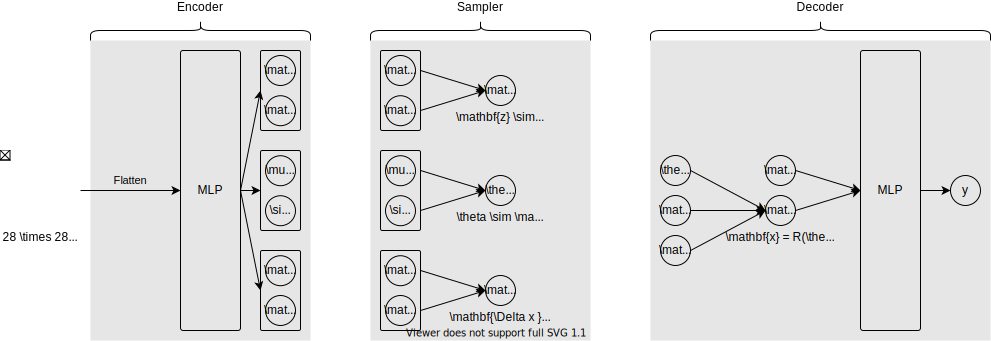

# Reproducibility Challenge - Stacked Capsule Autoencoders

## Getting Started

The experiments were run in `Python 3.7`.

```powershell
# Clone the repository.
git clone https://github.com/yannidd/reproducibility.git

# (Optional) Create a new Python environment and activate it.
# Windows:
python -m venv .env
.env\Scripts\activate.bat
# Unix or MacOS:
python3 -m venv .env
source .env/bin/activate

# Install the dependencies.
# Windows:
pip install -r requirements.txt
# Unix or MacOS:
pip3 install -r requirements.txt

# Windows Torch and Torchvision installation.
pip install torch==1.4.0+cpu torchvision==0.5.0+cpu -f https://download.pytorch.org/whl/torch_stable.html
```

## Spatial-VAE

<p align="center">
    
</p>

## References

[1] **Geometric Transformations** ([online](https://courses.cs.washington.edu/courses/csep576/11sp/pdf/Transformations.pdf))  
Larry Zitnick.
