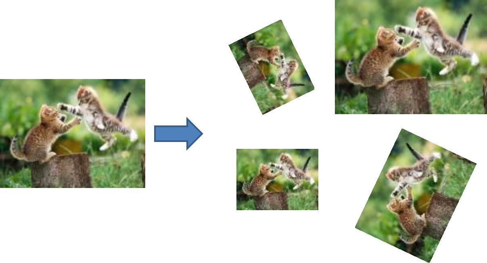
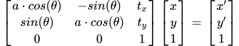

# Reproducibility Challenge - Stacked Capsule Autoencoders

## Useful Theory

### Similarity Transform

A similarity transform allows for 4 DoF - translation + rotation + scale [6].  

    

Change `t_x` and `t_y` for translation, `a` for scaling and `theta` for rotation.

    

## Further Reading

A good start to understand Capsule Networks is [4] - a series of 4 blog posts. If the Stacked Capsule Autoencoder paper [1] seems too technical, [2] provides a high level overview of the approach.

## References

[1] **Stacked Capsule Autoencoders Paper.** ([online](https://arxiv.org/abs/1906.06818))  
Kosiorek, Adam Roman and Sabour, Sara and Teh, Yee Whye and Hinton, Geoffrey Everest, 2019. Advances in Neural Information Processing Systems.

[2] **Stacked Capsule Autoencoders Blog Post.** ([online](http://akosiorek.github.io/ml/2019/06/23/stacked_capsule_autoencoders.html))  
Adam Kosiorek, 2019.

[3] **Stacked Capsule Autoencoders GitHub Repository.** ([online](https://github.com/google-research/google-research/tree/master/stacked_capsule_autoencoders))

[4] **Understanding Hinton’s Capsule Networks. Part I: Intuition.** ([online](https://medium.com/ai%C2%B3-theory-practice-business/understanding-hintons-capsule-networks-part-i-intuition-b4b559d1159b))  
Max Pechyonkin, 2017. AI³ | Theory, Practice, Business.

[5] **Awesome Capsule Networks.** ([online](https://github.com/sekwiatkowski/awesome-capsule-networks))  

[6] **Geometric Transformations** ([online](https://courses.cs.washington.edu/courses/csep576/11sp/pdf/Transformations.pdf))  
Larry Zitnick.
